# Project

**Authors**:  
- Bruno Tavares - 113372  
- Diogo Costa - 112714  

---

## 📋 **Project Summary**

This project implements a system for managing organizations, subjects, and documents using encryption to ensure data security.

---

## 🚀 **Implemented Features**

### 🔑 **Encryption**
- **`generate_aes_key()`**: Generates a 256-bit AES key for encryption.
- **`encrypt_data(data, aes_key)`**: Encrypts data using the AES algorithm with the provided key and CBC (Cipher Block Chaining) mode. Returns the encrypted data in base64.
- **`encrypt_all_data(data, aes_key)`**: Similar to `encrypt_data`, but encrypts all the data, including the initialization vector (IV) concatenated with the encrypted data, and returns it in base64.

### 🏢 **Organization Management**
- **`rep_create_org(org, username, name, email, pubkey)`**: Creates an organization, encrypts sensitive data such as the username, password, and public key using AES, and sends the encrypted data to the server.
- **`rep_list_orgs()`**: Makes a GET request to list all organizations registered on the server.

### 👤 **Subject Management**
- **`rep_add_subject(session_file, username, name, email, credentials_file)`**: Adds a new subject to an existing organization, encrypts the data, and sends it to the server, including the organization’s public key.
- **`rep_list_subjects(session_file, filter_username=None)`**: Requests a list of subjects from the organization associated with the active session and optionally filters by a username.
- **`rep_suspend_subject(session_file, username)`**: Suspends a subject from the organization based on the provided session file.
- **`rep_activate_subject(session_file, username)`**: Activates a subject in the organization based on the provided session file.

### 📂 **Document Management**
- **`rep_add_doc(session_file, document_handle, file_path)`**: Main function to upload a document. It checks if the file exists before attempting to upload it. The function encrypts the document’s metadata and payload using an AES key before sending the data securely to the server. It ensures that the AES key is also transmitted in base64 format along with the encrypted data, securing the file upload process.
- **`rep_get_doc_metadata(session_file, document_name)`**: Sends user arguments to the server to fetch metadata for a specified document. The function encrypts the metadata request using AES before sending it to the server. The AES key is also transmitted in base64 format along with the encrypted data, ensuring secure communication and protecting sensitive information during the request.
- **`rep_list_docs(session_file, creator=None, date_filter=None, date_value=None)`**: Sends a request to the server to list documents with optional filters.
- **`rep_delete_doc(session_file, document_name)`**: Sends a request to the server to delete a specified document. The function encrypts the payload using AES before sending the request, ensuring the security of the data. The AES key is also transmitted in base64 format alongside the encrypted data to ensure that the sensitive request data remains protected during the communication.
- **`rep_get_doc_file(session_file, document_name, output_file=None)`**: Sends data to the server to fetch and decrypt a document. The server handles permission checks and decryption. The function encrypts the request payload using AES and sends the encrypted data along with the AES key in base64 format to ensure secure communication. If an output file path is provided, the document is saved to that file; otherwise, the content is printed to the console.
- **`rep_get_file(file_handle, output_file=None)`**: This function requests a file from the server and saves its content to a local file or prints it to the standard output. `file_handle`: Identifier for the file to be downloaded. The payload is encrypted using AES.

---

## 🛠️ **How to Use**

###
```bash
./rep_subject_credentials.sh admin123 admin.pem

```
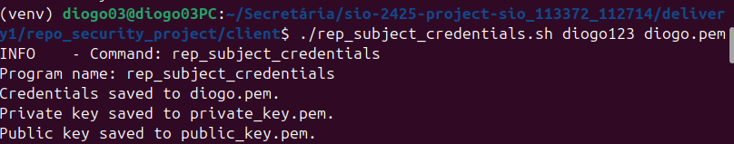
###
```bash
./rep_create_org.sh UA admin Antonio antonio@ua.pt ../client/public_key.pem 
```

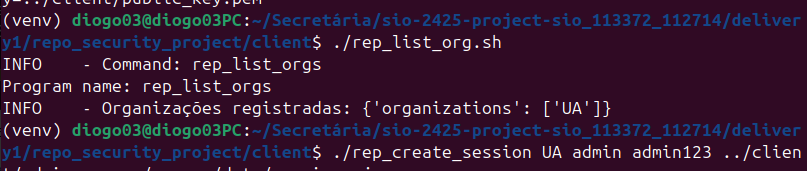

###
```bash
./rep_list_org.sh 
```


###
```bash
./rep_create_session.sh UA admin admin123 ../client/admin.pem ../server/sessions.json
```
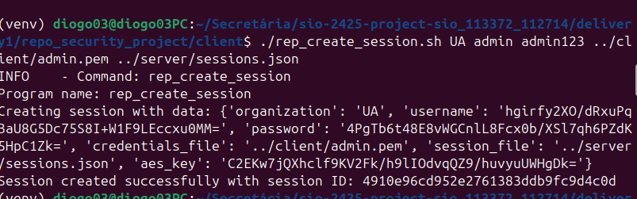

###
```bash
./rep_add_subject.sh ../server/sessions.json ronaldo Cristiano cr7@UA.pt ../client/public_key.pem 
```
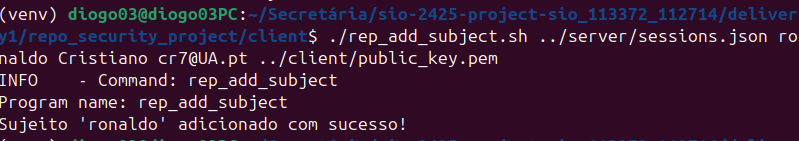

###
- **Suspender:**  
  ```bash
    ./rep_suspend_subject.sh ../server/sessions.json ronaldo 
  ```
- **Ativar:**  
  ```bash
  ./rep_activate_subject.sh ../server/sessions.json ronaldo
  ```
  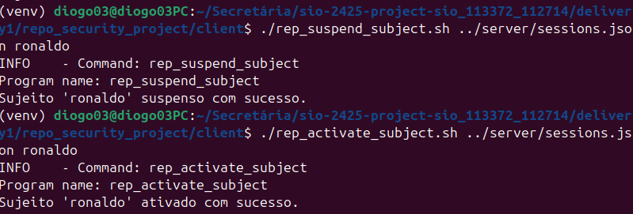
###
  ```bash
./rep_list_subjects.sh ../server/sessions.json
  ```

###
  ```bash
  ./rep_list_subjects.sh ../server/sessions.json ronaldo
  ```
  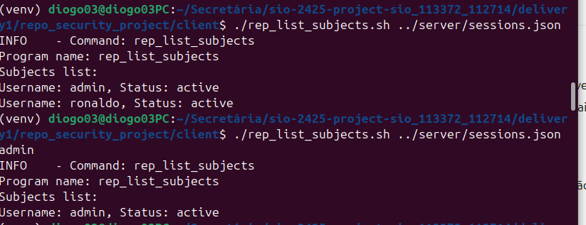

###
- **Adicionar:**  
  ```bash
  ./rep_add_doc.sh ../server/sessions.json Hello ../client/HelloWorld.txt
  ```
  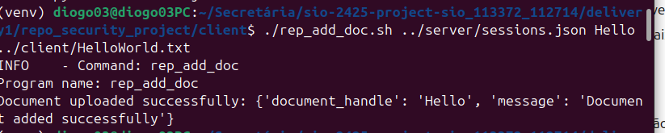
- **Metadata:**  
  ```bash
  ./rep_get_doc_metadata.sh ../server/sessions.json Hello
  ```
  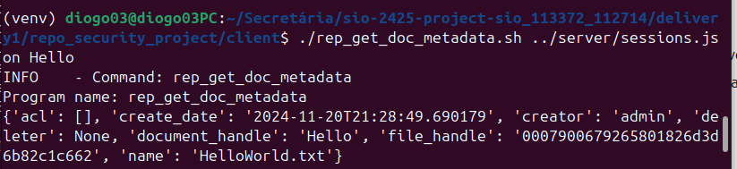
- **Listar:**  
  ```bash
  ./rep_list_docs.sh ../server/sessions.json
  ```
  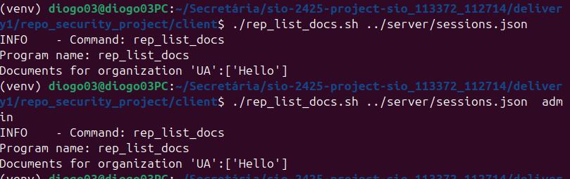
- **Fazer Download:**  
  ```bash
  ./rep_get_doc_file.sh ../server/sessions.json Hello
  ```
  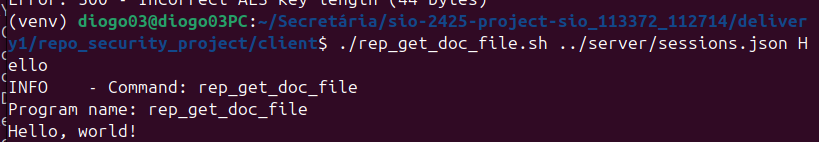
- **Excluir:**
  ```bash
    ./rep_delete_doc.sh ../server/sessions.json Hello
  ```
  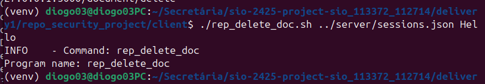
- **get_file:**
  ```bash
    ./rep_get_file.sh 0007900679265801826d3d6b82c1c662
  ```
  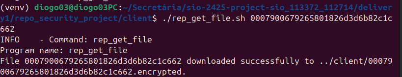
  `file_handle`: Identifier for the file, see in metadata.


