# Project

**Authors**:  
- Bruno Tavares - 113372  
- Diogo Costa - 112714  


## 2nd delivery
## 🛠️ **How to Use**

### init organization
```bash

{
    "UA": {
        "name": "UA",
        "subjects": [
            {
                "username": "admin",
                "name": "Antonio",
                "email": "antonio@ua.pt",
                "public_key": "-----BEGIN PUBLIC KEY-----\nMIIBIjANBgkqhkiG9w0BAQEFAAOCAQ8AMIIBCgKCAQEA4ux05LDP5eI+UuGsBPas\n8e30RwS50IhsyY4eyoZ/Lfq6dothm5V+MF3w8Z16bgXKQKm6P/PPHbC4ajmtvIRa\nP5k8SVCpp3A4I0vWYT2BDErHqvcmpeSL3xZPp7efO38NUn6fDl/Av8nvum9rrfpH\n8M3eZZbOE/o9N9zNmK52fJhA1/w8Pza2Bvwl/Qo7hKZ/0iFH/0Cza3i5apwnHfeT\nhAnVW1HuKCFJ3DE/rGZ7TFfQOl9l+yImqhIgIXkJDU+p+Iu+aIsoyKxyv5X73QPd\nMPb99gsnpnCyzfAwsO+5QQTGHUILtze7dxKvCSBplkkU+22UWaakPy3QkJT+hi80\n5wIDAQAB\n-----END PUBLIC KEY-----\n",
                "status": "active",
                "roles": [
                    "manager"
                ],
                "permissions": [
                    "ROLE_ACL",
                    "ROLE_DOWN",
                    "ROLE_UP",
                    "ROLE_NEW",
                    "ROLE_MOD",
                    "SUBJECT_NEW",
                    "SUBJECT_UP",
                    "SUBJECT_DOWN",
                    "DOC_NEW",
                    "DOC_READ",
                    "DOC_DELETE",
                    "DOC_ACL"
                ]
            },
            {
                "username": "ronaldo",
                "name": "Cristiano",
                "email": "cr7@UA.pt",
                "public_key": "-----BEGIN PUBLIC KEY-----\nMIIBIjANBgkqhkiG9w0BAQEFAAOCAQ8AMIIBCgKCAQEA4ux05LDP5eI+UuGsBPas\n8e30RwS50IhsyY4eyoZ/Lfq6dothm5V+MF3w8Z16bgXKQKm6P/PPHbC4ajmtvIRa\nP5k8SVCpp3A4I0vWYT2BDErHqvcmpeSL3xZPp7efO38NUn6fDl/Av8nvum9rrfpH\n8M3eZZbOE/o9N9zNmK52fJhA1/w8Pza2Bvwl/Qo7hKZ/0iFH/0Cza3i5apwnHfeT\nhAnVW1HuKCFJ3DE/rGZ7TFfQOl9l+yImqhIgIXkJDU+p+Iu+aIsoyKxyv5X73QPd\nMPb99gsnpnCyzfAwsO+5QQTGHUILtze7dxKvCSBplkkU+22UWaakPy3QkJT+hi80\n5wIDAQAB\n-----END PUBLIC KEY-----\n",
                "status": "suspended",
                "roles": [
                    "leitor"
                ],
                "permissions": [
                    "ROLE_ACL",
                    "ROLE_UP",
                    "DOC_READ"
                ]
            },
            {
                "username": "joaquim",
                "name": "Joaquim",
                "email": "joaquim@UA.pt",
                "public_key": "-----BEGIN PUBLIC KEY-----\nMIIBIjANBgkqhkiG9w0BAQEFAAOCAQ8AMIIBCgKCAQEA4ux05LDP5eI+UuGsBPas\n8e30RwS50IhsyY4eyoZ/Lfq6dothm5V+MF3w8Z16bgXKQKm6P/PPHbC4ajmtvIRa\nP5k8SVCpp3A4I0vWYT2BDErHqvcmpeSL3xZPp7efO38NUn6fDl/Av8nvum9rrfpH\n8M3eZZbOE/o9N9zNmK52fJhA1/w8Pza2Bvwl/Qo7hKZ/0iFH/0Cza3i5apwnHfeT\nhAnVW1HuKCFJ3DE/rGZ7TFfQOl9l+yImqhIgIXkJDU+p+Iu+aIsoyKxyv5X73QPd\nMPb99gsnpnCyzfAwsO+5QQTGHUILtze7dxKvCSBplkkU+22UWaakPy3QkJT+hi80\n5wIDAQAB\n-----END PUBLIC KEY-----\n",
                "status": "active",
                "roles": [
                    "funcionario"
                ],
                "permissions": [
                    "SUBJECT_NEW",
                    "SUBJECT_UP",
                    "SUBJECT_DOWN"
                ]
            }
        ],
        "roles": {
            "manager": [
                "ROLE_ACL",
                "ROLE_DOWN",
                "ROLE_UP",
                "ROLE_NEW",
                "ROLE_MOD",
                "SUBJECT_NEW",
                "SUBJECT_UP",
                "SUBJECT_DOWN",
                "DOC_NEW",
                "DOC_READ",
                "DOC_DELETE",
                "DOC_ACL"
            ],
            "leitor": [
                "ROLE_ACL",
                "ROLE_UP",
                "DOC_READ"
            ],
            "funcionario": [
                "SUBJECT_NEW",
                "SUBJECT_UP",
                "SUBJECT_DOWN"
            ]
        },
        "role status": {
            "manager": "active",
            "leitor": "active",
            "funcionario": "active"
        },
        "acl": {
            "manager": [
                "admin"
            ],
            "leitor": [
                "ronaldo"
            ],
            "funcionario": [
                "joaquim"
            ]
        },
        "docs": [
            "Hello"
        ],
        "Hello": {
            "manager": [
                "DOC_NEW",
                "DOC_READ",
                "DOC_DELETE"
            ],
            "leitor": [
                "DOC_READ"
            ]
        }
    }
}

```
add role in org
```bash
./rep_add_role.sh ../server/sessions.json visitante
```
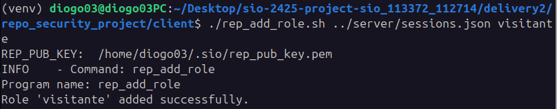

suspend role
###
```bash
./rep_suspend_role.sh ../server/sessions.json visitante
```
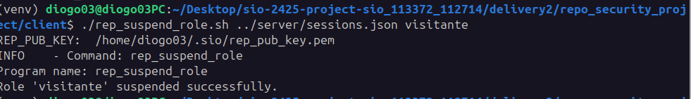

reactivate role
###
```bash
./rep_reactivate_role.sh ../server/sessions.json visitante
```
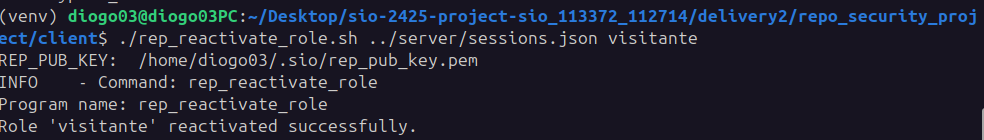

list all roles (actives roles and inactice/past roles )
###
```bash
./rep_list_roles.sh ../server/sessions1.json
```
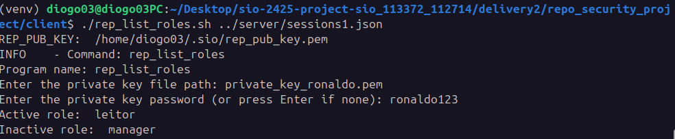

add a permission in a specific role
###
```bash
./rep_add_permission.sh ../server/sessions.json visitante DOC_READ
```
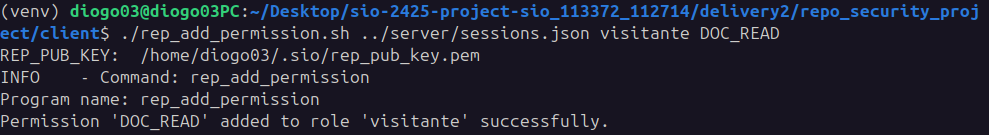

add a role in a subject
###
```bash
./rep_add_permission.sh ../server/sessions.json visitante joaquim
```
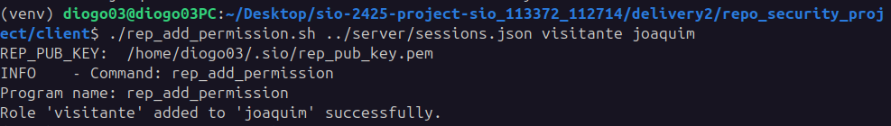

remove a permission in a specific role
###
```bash
./rep_remove_permission.sh ../server/sessions1.json visitante DOC_READ
```
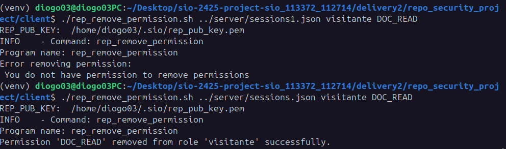

remove a role in a subject
###
```bash
./rep_remove_permission.sh ../server/sessions1.json visitante joaquim
```
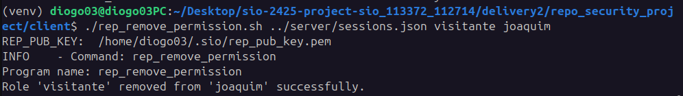

subject can assume a role ("must first run ./rep_add_permission.sh to assign a role to a subject, so that the subject can then assume the role and its permissions.")
###
```bash
./rep_assume_role.sh ../server/sessions2.json visitante
```
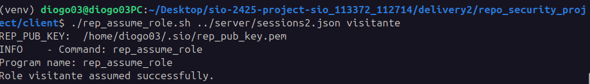

drop the role assumed before
###
```bash
./rep_drop_role.sh ../server/sessions2.json visitante
```
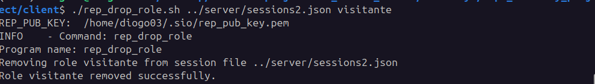

list the permissions for a specific role
###
```bash
./rep_list_role_permissions.sh ../server/sessions1.json leitor
```
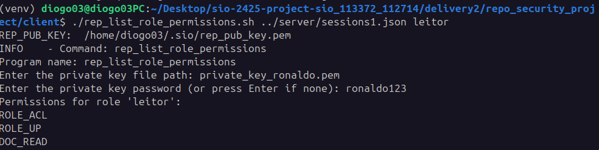

list the roles for a specific permission
###
```bash
./rep_list_permission_roles.sh ../server/sessions1.json DOC_READ
```
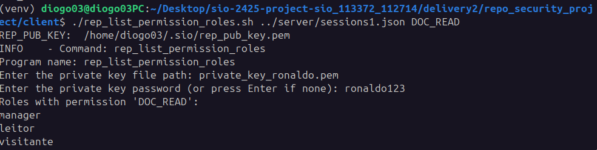

list roles for a specific subject
###
```bash
./rep_list_subject_roles.sh ../server/sessions1.json joaquim
```
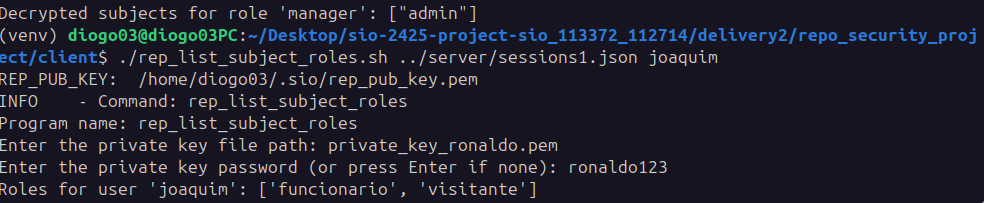

list subjects for a specific role
###
```bash
./rep_list_role_subject.sh ../server/sessions1.json manager
```
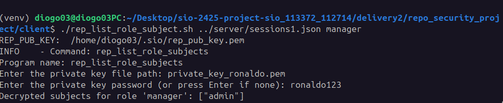

add a doc "Hello2"
###
```bash
./rep_add_doc.sh ../server/sessions.json Hello2 ../client/HelloWorld.txt
```
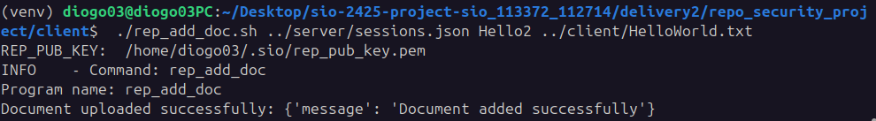

list all docs
###
```bash
./rep_list_docs.sh ../server/sessions.json
```
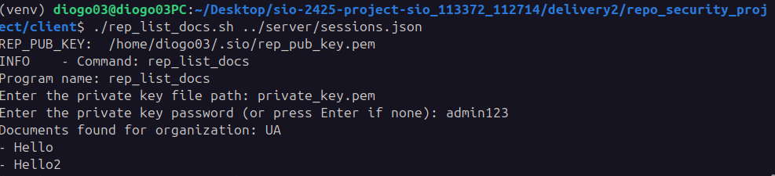

add or remove a permission for a given role (in acl document specified)
###
```bash
./rep_acl_doc ../server/sessions.json Hello +/- leitor DOC_READ
```
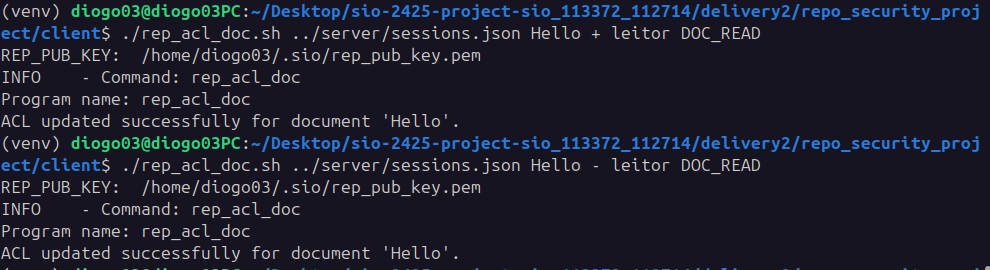

## organization result after commands
```bash
{
    "UA": {
        "name": "UA",
        "subjects": [
            {
                "username": "admin",
                "name": "Antonio",
                "email": "antonio@ua.pt",
                "public_key": "-----BEGIN PUBLIC KEY-----\nMIIBIjANBgkqhkiG9w0BAQEFAAOCAQ8AMIIBCgKCAQEA4ux05LDP5eI+UuGsBPas\n8e30RwS50IhsyY4eyoZ/Lfq6dothm5V+MF3w8Z16bgXKQKm6P/PPHbC4ajmtvIRa\nP5k8SVCpp3A4I0vWYT2BDErHqvcmpeSL3xZPp7efO38NUn6fDl/Av8nvum9rrfpH\n8M3eZZbOE/o9N9zNmK52fJhA1/w8Pza2Bvwl/Qo7hKZ/0iFH/0Cza3i5apwnHfeT\nhAnVW1HuKCFJ3DE/rGZ7TFfQOl9l+yImqhIgIXkJDU+p+Iu+aIsoyKxyv5X73QPd\nMPb99gsnpnCyzfAwsO+5QQTGHUILtze7dxKvCSBplkkU+22UWaakPy3QkJT+hi80\n5wIDAQAB\n-----END PUBLIC KEY-----\n",
                "status": "active",
                "roles": [
                    "manager"
                ],
                "permissions": [
                    "ROLE_ACL",
                    "ROLE_DOWN",
                    "ROLE_UP",
                    "ROLE_NEW",
                    "ROLE_MOD",
                    "SUBJECT_NEW",
                    "SUBJECT_UP",
                    "SUBJECT_DOWN",
                    "DOC_NEW",
                    "DOC_READ",
                    "DOC_DELETE",
                    "DOC_ACL"
                ]
            },
            {
                "username": "ronaldo",
                "name": "Cristiano",
                "email": "cr7@UA.pt",
                "public_key": "-----BEGIN PUBLIC KEY-----\nMIIBIjANBgkqhkiG9w0BAQEFAAOCAQ8AMIIBCgKCAQEA4ux05LDP5eI+UuGsBPas\n8e30RwS50IhsyY4eyoZ/Lfq6dothm5V+MF3w8Z16bgXKQKm6P/PPHbC4ajmtvIRa\nP5k8SVCpp3A4I0vWYT2BDErHqvcmpeSL3xZPp7efO38NUn6fDl/Av8nvum9rrfpH\n8M3eZZbOE/o9N9zNmK52fJhA1/w8Pza2Bvwl/Qo7hKZ/0iFH/0Cza3i5apwnHfeT\nhAnVW1HuKCFJ3DE/rGZ7TFfQOl9l+yImqhIgIXkJDU+p+Iu+aIsoyKxyv5X73QPd\nMPb99gsnpnCyzfAwsO+5QQTGHUILtze7dxKvCSBplkkU+22UWaakPy3QkJT+hi80\n5wIDAQAB\n-----END PUBLIC KEY-----\n",
                "status": "suspended",
                "roles": [
                    "leitor"
                ],
                "permissions": [
                    "ROLE_ACL",
                    "ROLE_UP",
                    "DOC_READ"
                ]
            },
            {
                "username": "joaquim",
                "name": "Joaquim",
                "email": "joaquim@UA.pt",
                "public_key": "-----BEGIN PUBLIC KEY-----\nMIIBIjANBgkqhkiG9w0BAQEFAAOCAQ8AMIIBCgKCAQEA4ux05LDP5eI+UuGsBPas\n8e30RwS50IhsyY4eyoZ/Lfq6dothm5V+MF3w8Z16bgXKQKm6P/PPHbC4ajmtvIRa\nP5k8SVCpp3A4I0vWYT2BDErHqvcmpeSL3xZPp7efO38NUn6fDl/Av8nvum9rrfpH\n8M3eZZbOE/o9N9zNmK52fJhA1/w8Pza2Bvwl/Qo7hKZ/0iFH/0Cza3i5apwnHfeT\nhAnVW1HuKCFJ3DE/rGZ7TFfQOl9l+yImqhIgIXkJDU+p+Iu+aIsoyKxyv5X73QPd\nMPb99gsnpnCyzfAwsO+5QQTGHUILtze7dxKvCSBplkkU+22UWaakPy3QkJT+hi80\n5wIDAQAB\n-----END PUBLIC KEY-----\n",
                "status": "active",
                "roles": [
                    "funcionario"
                ],
                "permissions": []
            }
        ],
        "roles": {
            "manager": [
                "ROLE_ACL",
                "ROLE_DOWN",
                "ROLE_UP",
                "ROLE_NEW",
                "ROLE_MOD",
                "SUBJECT_NEW",
                "SUBJECT_UP",
                "SUBJECT_DOWN",
                "DOC_NEW",
                "DOC_READ",
                "DOC_DELETE",
                "DOC_ACL"
            ],
            "leitor": [
                "ROLE_ACL",
                "ROLE_UP",
                "DOC_READ"
            ],
            "funcionario": [
                "SUBJECT_NEW",
                "SUBJECT_UP",
                "SUBJECT_DOWN"
            ],
            "visitante": []
        },
        "role_status": {
            "manager": "active",
            "leitor": "active",
            "funcionario": "active",
            "visitante": "active"
        },
        "acl": {
            "manager": [
                "admin"
            ],
            "leitor": [
                "ronaldo"
            ],
            "funcionario": [
                "joaquim"
            ],
            "visitante": []
        },
        "docs": [
            "Hello",
            "Hello2"
        ],
        "Hello": {
            "manager": [
                "DOC_NEW",
                "DOC_READ",
                "DOC_DELETE"
            ],
            "leitor": [
                "DOC_READ"
            ]
        }
    }
}
```
## Security

### Secure Flow: Client-Server Communication

---

#### **1. Client to Server (Client → Server)**

- **Client initiates the request:**
  - The client has sensitive data to send to the server, such as permissions or session information.

- **Data encryption:**
  - The data is encrypted using a dynamically generated **AES symmetric key**. This key ensures efficient and secure data encryption.

- **AES key protection:**
  - To ensure only the server can access the data, the AES key is encrypted using the **server’s public key** (RSA).

- **Data transmission to the server:**
  - The client sends two components to the server:
    1. **The data encrypted** with AES.
    2. **The AES key encrypted** with the server’s public key.

---

#### **2. Server Processes the Request (Server)**

- **Receiving the data:**
  - The server receives the encrypted data sent by the client.

- **Decrypting the AES key:**
  - The server uses its **private key** to decrypt the AES key.

- **Decrypting the data:**
  - Using the decrypted AES key, the server retrieves the original data sent by the client.

- **Processing:**
  - The server performs the required logic, such as verifying permissions or retrieving the requested information.

---

#### **3. Server Sends Data Back to Client (Server → Client)**

- **Preparing the response:**
  - After processing, the server needs to send a response to the client. This response may include sensitive data, such as roles associated with a permission.

- **Encrypting the response data:**
  - The server uses the **client’s public key** to encrypt the data. This ensures that only the client, with its private key, can decrypt the information.

- **Sending data to the client:**
  - The server sends the encrypted response back to the client.

---

#### **4. Client Processes the Response (Client)**

- **Receiving the data:**
  - The client receives the encrypted data sent by the server.

- **Providing the private key:**
  - In some cases, the client must provide:
    1. The **name of the file** containing its private key.
    2. The **password for the private key**, if protected. If no password is set, the client can simply press Enter.

- **Decrypting the data with the private key:**
  - The client uses its **private key** to decrypt the received data. The private key is loaded from the specified file and unlocked with the provided password.

- **Processing the response:**
  - After decryption, the client obtains the information returned by the server and uses it as needed, such as for display or performing actions based on the data.

---

### **Summary: Security in the Flow**

- **Confidentiality:** Ensured by using symmetric encryption (AES) for the data and asymmetric encryption (RSA) for the keys.
- **Integrity:** Any alteration to the data invalidates decryption.
- **Authenticity:** Only the legitimate client and server possess the keys necessary for communication.
- **Bidirectional protection:** Both the request and response are protected, ensuring security throughout the interaction.

---

### **Note 📝:**  
In some commands, the server processes the client’s request without sending any data back. In such cases, the interaction ends after the server completes the request processing.

Some commands will only function if there is a **role** with the **necessary permissions** in the **active session**. Without the required role or permissions, the command will not be processed successfully.

Make sure that the active session includes a valid role with the appropriate permissions for the command to execute properly. If the required role or permission is missing, the server may return an error or deny the request.

